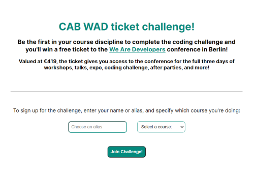
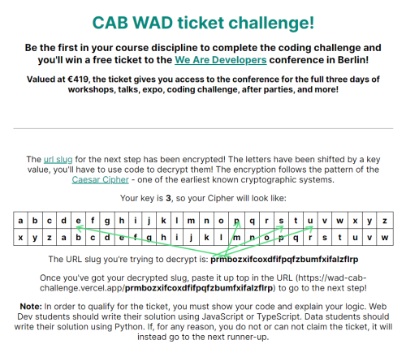
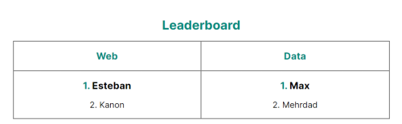

# WAD CAB Coding Challenge

The purpose of this small project is to provide a simple coding challenge to the students of [Code Academy Berlin](https://www.codeacademyberlin.com/). The school had two tickets for the 2024 [We Are Developers](https://www.wearedevelopers.com/) World Congress conference in Berlin to give away. We wanted a simple coding challenge that our students from both Data Science and Web Development disciplines could complete, the fastest from each course would win a ticket. 

The project uses the full-stack framework [Next.js](https://nextjs.org/), together with NoSQL database [MongoDB](https://www.mongodb.com/). I chose against implementing any authentication, simply storing the student alias in a cookie to persist their session, as this was intended to be a small challenge that could be completed in no more than a few hours.

# Landing page before signing up

# Landing page after signing up

Once the students have signed up, they will be able to read about the challenge. They must first use a Caeser Cipher to decrypt the slug where they will find instructions for the next step. The only problem we really had with this view, is that quite a few people misinterpreted the table - the task is to _decrypt_ the slug, not _encrypt_ the slug, meaning you need compare the bottom row to the top, not the other way around. 

# Second step page

Once the student has successfully decrypted the slug, they can visit this page. The challenge is mostly the same, but I have increased the length and complexity of the string to be decrypted to encourage them to adapt their existing function. If they are able to decrypt the string, if the lines are not already familiar, a quick Google search should find the movie title they need to give to the input.

# Leaderboard

Once students start completing the challenge, their alias will appear in the leaderboard on the landing page. 

